# 🎓 PAW - Sistem Informasi Lomba (Laravel Project)

Ini adalah project Laravel yang dikembangkan untuk memenuhi tugas mata kuliah Pemrograman Aplikasi Web.  
Fitur utama meliputi:

## ⚙️ Fitur
- Manajemen lomba oleh admin
- Pendaftaran lomba oleh mahasiswa
- Notifikasi pendaftaran
- Dashboard
- Statistik

## 📸 Tampilan Aplikasi

### 🖼 Dashboard Guest
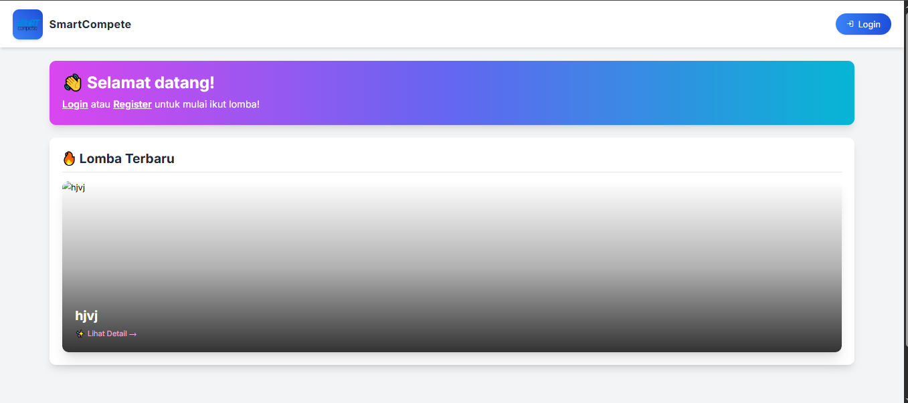

### 🖼 Login
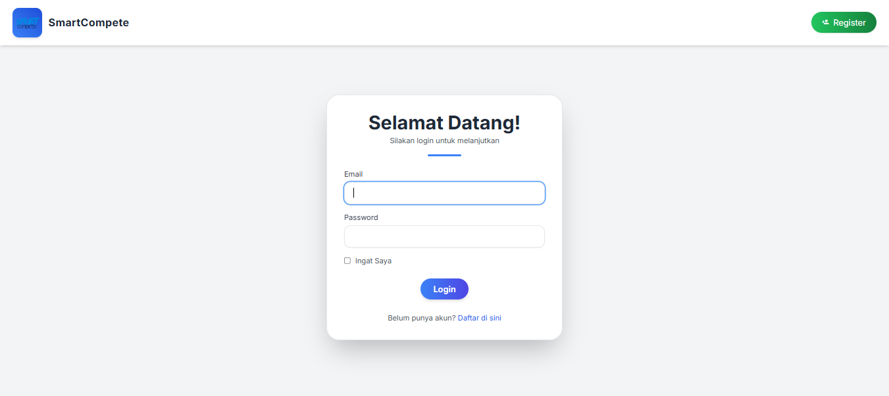

### 🖼 Register
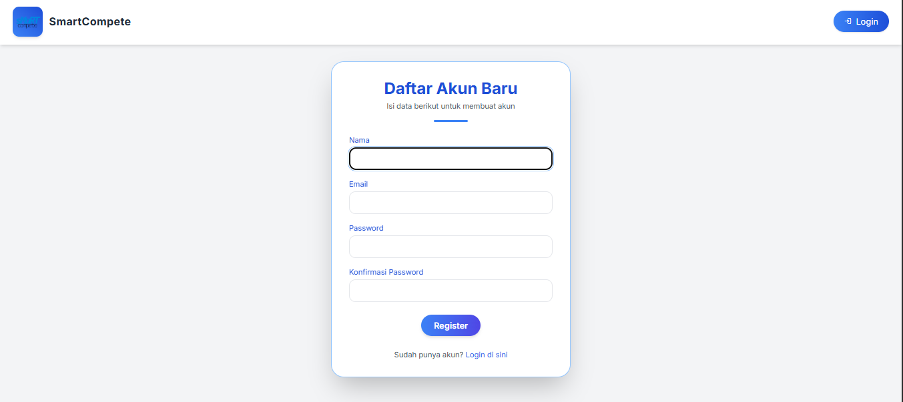

### 🖼 Dashboard Admin
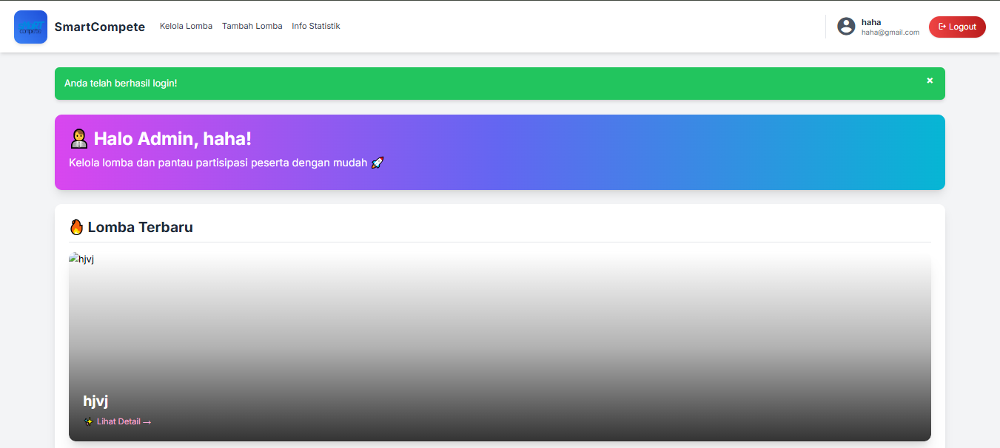

### 🖼 Kelola Lomba (Admin)
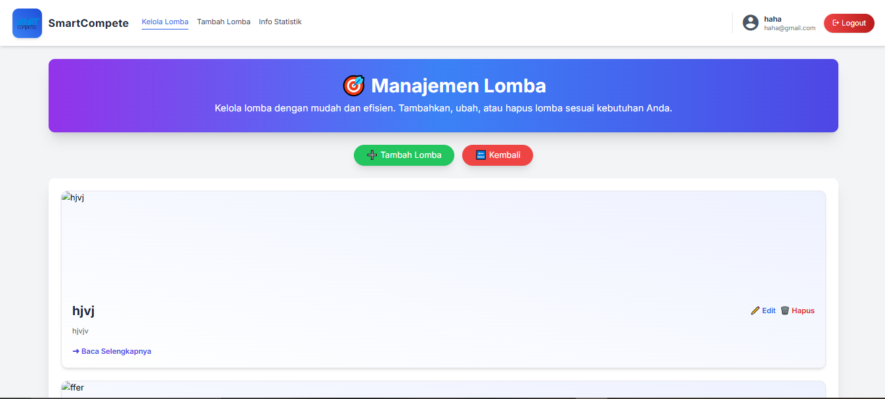

### 🖼 Tambah Lomba (Admin)
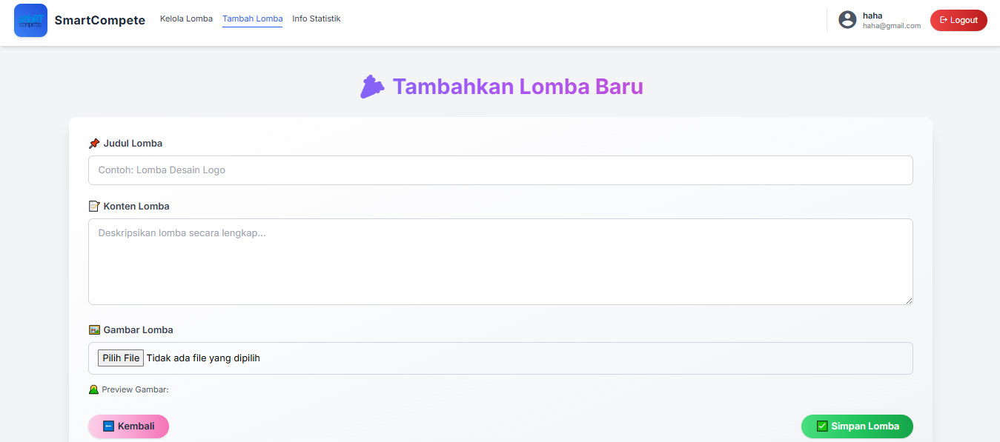

### 🖼 Info Statistik Lomba (Admin)
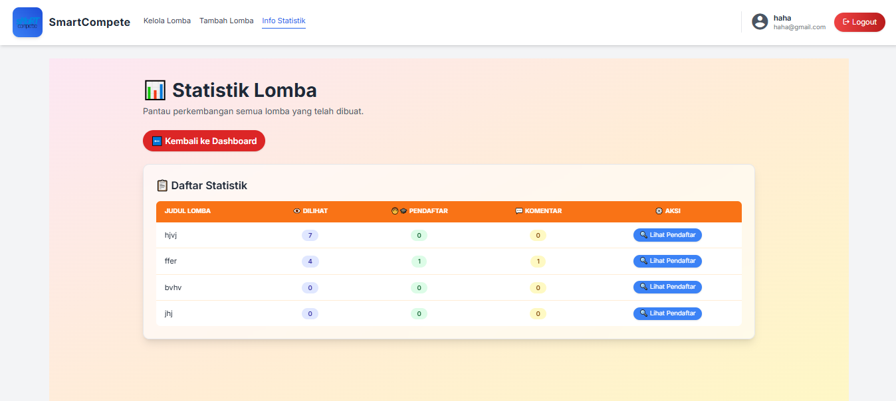

### 🖼 Dashboard Mahasiswa (Mahasiswa)
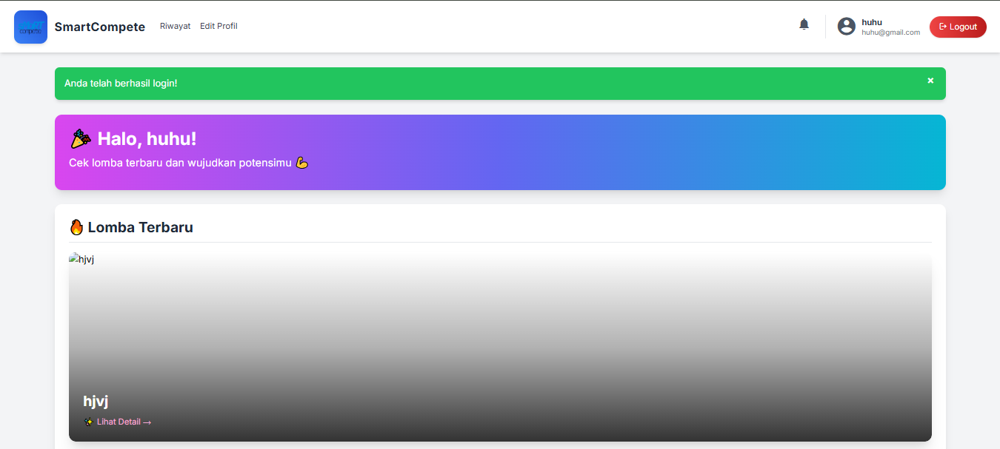

### 🖼 Riwayat Mahasiswa (Mahasiswa)
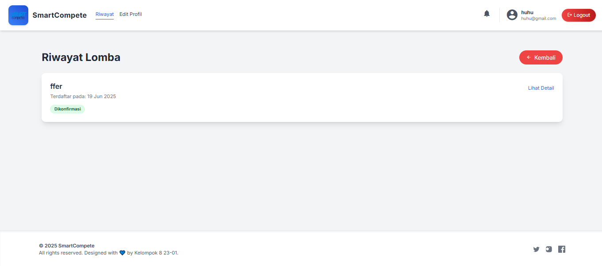

### 🖼 Edit Profil Mahasiswa (Mahasiswa)
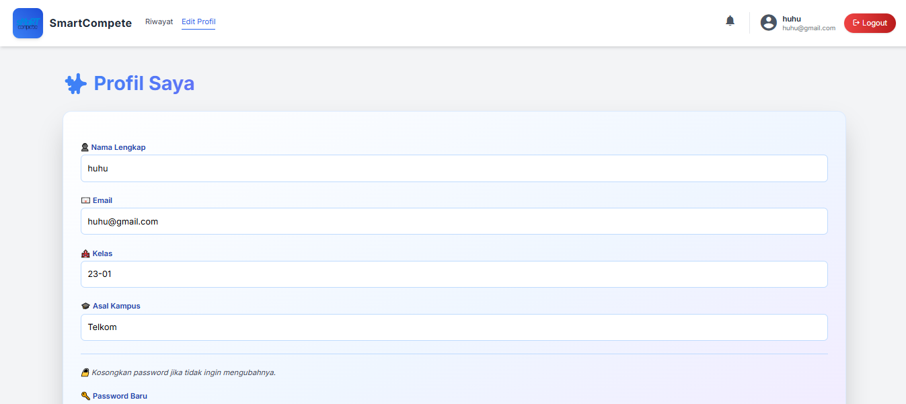

### 🖼 Notifikasi Lomba (Mahasiswa)
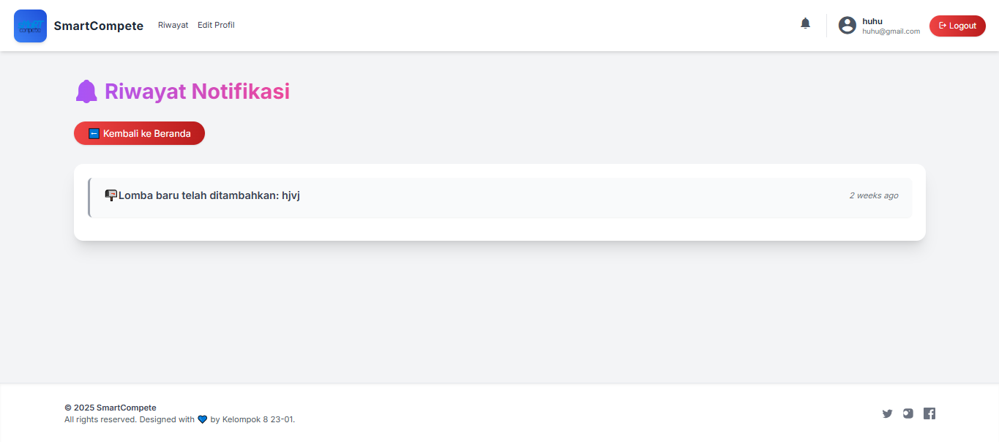

## 💡 Teknologi yang Digunakan
- Laravel 10
- MySQL
- Blade Template
- Bootstrap 5

## 🛠 Cara Menjalankan (Developer)
1. Clone repo ini
2. Jalankan `composer install`
3. Copy file `.env.example` jadi `.env` lalu atur database
4. Jalankan `php artisan db:seed`
5. Jalankan `php artisan migrate`
6. Jalankan `php artisan serve`
7. Masukkan email `haha@gmail.com` dan password `hahahihi` untuk login sebagai admin.
